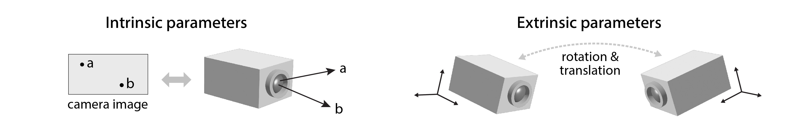

Multi-Camera Calibration
========================

This package provides a pipeline for multi-camera calibration, as well as general geometry utilities like keypoint triangulation and reprojection. There are several other packages include their own calibration pipelines, including `anipose <https://github.com/lambdaloop/anipose>`_, `FreiPose <https://github.com/lmb-freiburg/FreiCalib>`_ and `JARVIS <https://jarvis-mocap.github.io/jarvis-docs/>`_. We created a new library for multicamera calibration because we wanted:

- a standalone calibration solution that can be mixed and matched with other tools
- a modular, extendable and well-documented code base
- a pedagogical pipeline that exposes each step of the process
- the ability to register camera that point in opposite directions

What is calibration?
~~~~~~~~~~~~~~~~~~~~

Calibration is the process of measuring the *intrinsic* and *extrinsic* parameters of two or more cameras that are being used to track things in 3D. **Intrinsics** are private to each camera and include parameters like focal length and radial distortion that determine the relationship between pixels in the camera image and lines in 3D space. **Extrinsics** capture the relative translations and rotations between cameras (see diagram). For more details, see `Under the hood <math.html>`_.

|

Who should use this tool?
~~~~~~~~~~~~~~~~~~~~~~~~~

Anyone using multiple cameras (or a single camera with mirrors) to track stuff in 3D can use this package. The main use case we had in mind is 3D pose tracking for animal behavior research. We include import/export functions for a variety of 3D tracking packages, including JARVIS and GIMBAL. In fact, our pipeline can function as a drop-in replacement for the calibration steps in JARVIS or anipose. If would like to integrate ``multicam_calibration`` into your pipeline, feel free to open a `github issue <https://github.com/dattalab-6-cam/multicam-calibration/issues>`_!

.. toctree::
   :caption: Setup

   setup

.. toctree::
   :caption: Tutorial

   calibration_tutorial

.. toctree::
   :caption: Under the hood

   math

.. toctree::
   :caption: Troubleshooting

   troubleshooting

.. toctree::
   :caption: API Documentation

   api