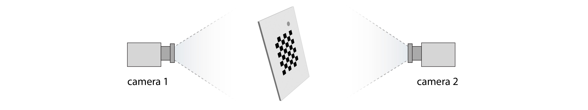
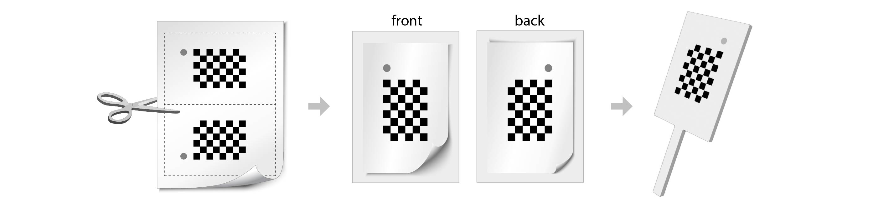
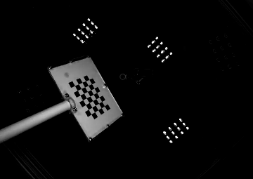

Installation
------------

First install `Anaconda <https://docs.anaconda.com/anaconda/install/index.html>`_ or `Miniconda <https://docs.conda.io/en/latest/miniconda.html>`_ and create a conda environment called ``calibration``::

   conda create -n calibration python=3.9
   conda activate calibration

Next install multicam-calibration using pip::

    pip install git+https://github.com/calebweinreb/multicam-calibration.git

To use multicam-calibration in a jupyter notebook, execute the following line with the ``calibration`` environment active. The environment should then be listed as an option when creating a new notebook or switching kernels (``Kernel > Change Kernel > calibration``)::

   python -m ipykernel install --user --name=calibration

Camera setup
------------

Multi-view recording setups can include multiple cameras with different view-angles, or a single camera augmented with mirrors. We are agnostic to the exact setup, as long as each view-angle can be supplied as a separate video file. In contrast to other 3D tracking packages (such as `JARVIS <https://jarvis-mocap.github.io/jarvis-docs/>`_, `anipose <https://github.com/lambdaloop/anipose>`_ and `FreiPose <https://github.com/lmb-freiburg/FreiCalib>`_), we use a two-sided calibration object so that cameras can face in opposite directions (see figure).

   
|

Resources for synchronizing multiple cameras:
  - `Multicamera acquisition <https://github.com/dattalab-6-cam/multicamera_acquisition>`_ package developed in the Datta lab at Harvard Medical School.
  - `JARVIS - Markerless 3D Motion Capture Toolbox <https://jarvis-mocap.github.io/jarvis-docs/>`_

Building the calibration object
-------------------------------

We currently support calibration using a checkerboard. To make the pattern visible from opposite angles, we use a two-sided calibration object and include a small dot that can be used to identify the same point from both sides. To build the calibration object:

1. Print out `this pattern <_static/calibration_printout1.pdf>`_. Adjust the size as necessary to fit your cameras' field of view. 
2. Cut along the dotted lines of the pattern, yielding two paper rectangles with mirror symmetry.
3. Affix the two rectangles to a transparent piece of plastic or glass so that the checkerboard patterns are visible from both sides. Make sure that the checkerboards are precisely aligned and the dot is in the same position on both sides.
4. Optionally attach a handle to the calibration object to make it easier to hold and move around.

|

Acquiring calibration videos
----------------------------

The first step of calibration is to record a calibration video. This involves filming the calibration object from each camera angle simultaneously while rotating it and moving it around. We recommend filming for 2 full minutes to ensure that the calibration algorithm has enough data to work with. An extremely sped up example is shown below.

|

Additional tips:
   - Make sure the calibration object is unobstructed and fits entirely within each camera's field of view (at least most of the time). Otherwise it won't be detected.
   - Cover a broad range of angles and locations for best results.
   - Avoid motion blur by moving the object slowly or (better) minizing the camera's explosure time.
   - Make sure that the videos are not washed-out or overly dim. The checker pattern and gray corner-dot should be clearly visible in most frames. 
