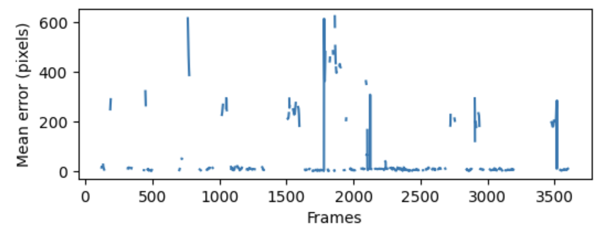

.. note::
    All the code snippets below are meant to be used in the context of the Turorial notebook.

High reprojection error
-----------------------

Reprojection error is the difference between observed and projected points on the calibration object, and can be checked using :py:func:`multicam_calibration.viz.plot_residuals`. High median error (e.g. > 1) may indicate that calibration has failed. The following factors can contribute to high reprojection error.

1. Insufficient number/diversity of overlapping detections. 

    To correctly calculate the camera extrinsics, there must be a sufficient number and variety of shared detections of the calibration object. Based on the number of pairwise overlaps between each pair of cameras (which can be checked using :py:func:`multicam_calibration.detection.summarize_detections`), a maximum spanning tree (MST) is constructed relating each camera to the root the camera (see XXX). If any edge of the MST has insufficient detections, the calibration will fail. To check the number and temporal distributon of shared detections across each camera-pair in the MST, run:

    .. code-block:: python

        mcc.plot_shared_detections(all_calib_uvs, spanning_tree);

    Here is an example of the output for a successful calibration:

    .. image:: _static/successful_shared_detections.jpg
        :width: 600px

    A failure mode would be if one of the rows contained very few detections, or if all the detections were concentrated at a single moment in time (and thus dis not cover a variety of angles for the calibration object). To troubleshoot too few overlapping detections, see `Poor detection of calibration object`_ below.

2. Large number of detection errors.

    Assuming initial calibration converges to roughly the correct solution, detection errors will lead to visible outliers in the output of :py:func:`multicam_calibration.viz.plot_residuals`, as seen for "camera 4" below. To troubleshoot erroneous detections, see `Detection errors`_ below.

    .. image:: _static/outliers_example.png
        :width: 600px

    

Detection errors
----------------

If a camera appears to have a high number of outlier frames (e.g. as revealed by :py:func:`multicam_calibration.viz.plot_residuals`; see above), the first step is to identify the frames where might be occuring and visualize the detections. The following code snippet plots the mean reprojection error over time for a single camera:

.. code-block:: python
    
    camera_ix = 1 # camera we wish to diagnose
    error = np.linalg.norm((reprojections - all_calib_uvs)[camera_ix], axis=2).mean(1)
    plt.plot(error)
    plt.xlabel('Frames')
    plt.ylabel('Mean error (pixels)')
    plt.gcf().set_size_inches((6,2))

In this example, we can see several spikes in the error, including around frame 1500. The code below saves a video clip with the detections overlaid, which reveals that the problem is reflections.

.. code-block:: python

    mcc.overlay_detections('path/to/video.mp4', frame_range=(1400, 1700))

.. image:: _static/detection_errors_example.gif
    :width: 400px

|

Poor detection of calibration object
------------------------------------

[STUB]
Object must be fully within the image to be detected. Should ideally be detected in >50% of frames where it is visible. Possible reasons for non-detection (assuming object is a chessboard pattern) are listed below.

- Wrong ``board_shape`` parameter (see XXX for determining this parameter)

- Occlusions and/or reflections

- Poor focus or motion blur

