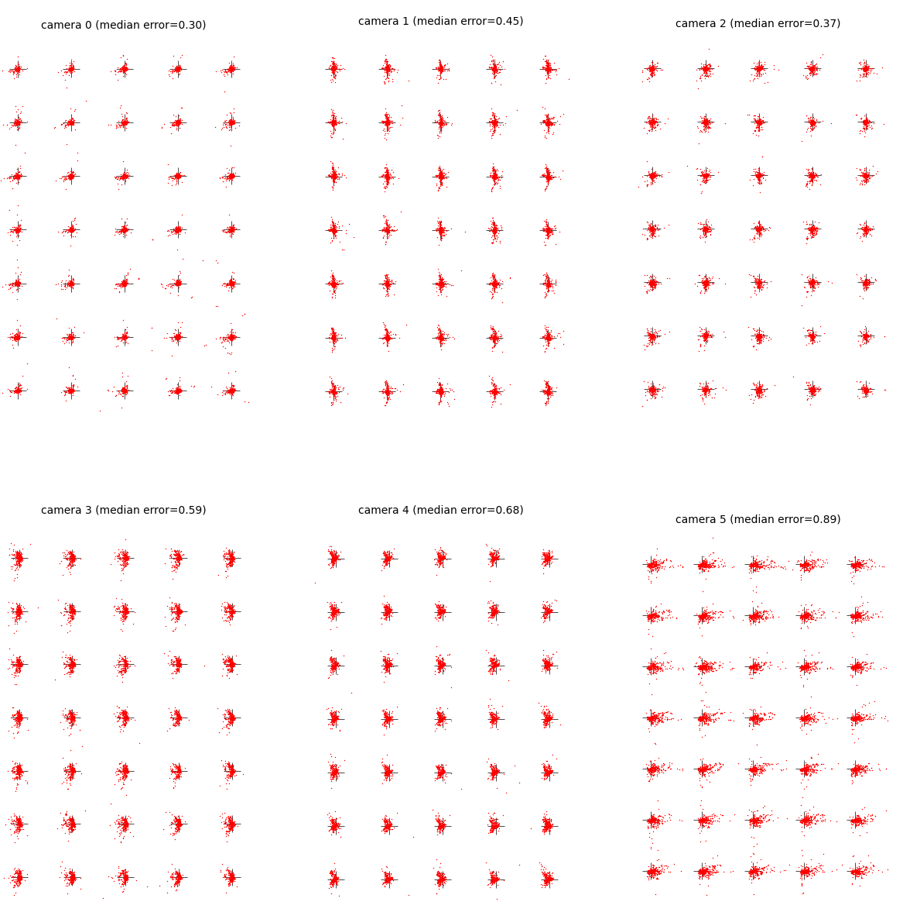

High reprojection error
-----------------------

Reprojection error is the difference between observed and projected points on the calibration object. The function :py:func:`multicam_calibration.viz.plot_residuals` plots reprojection errors for all cameras and all frames and reports the median error for each camera. Example output for a successful calibration is shown below:

High median error (e.g. > 1) may indicate that calibration has failed. The following factors can contribute to high reprojection error:

1. Insufficient number/diversity of overlapping detections. 

    To check the number of overlapping detections between all pairs of cameras, run:

    .. code-block:: python

        mcc.summarize_detections(all_calib_uvs)

    The camera-pairs that matter most are the edges of the maximum spanning tree (MST) used for initial calibration (see XXX). Use :py:func:`multicam_calibration.viz.plot_shared_detections` to visualize overlapping detections for edges of the MST. Example output for a successful calibration is shown below:

    [IMAGE]

    Problematic camera-pairs are those with few overlapping detections, or those for which the shared detections are all concentrated at a single moment in time (and thus do not cover a variety of angles for the calibration object). To troubleshoot too few overlapping detections, see `Poor detection of calibration object`_ below.

2. Large number of erroneous detections.

    Erroneous detections may be evident in the output of :py:func:`multicam_calibration.viz.plot_residuals` as outlier points, as seen in the example below:

    .. image:: _static/outliers_example.png
        :width: 300px

    To troubleshoot erroneous detections, see `Detection errors`_ below.

Detection errors
----------------

If a camera appears to have a high number of outlier frames (e.g. as revealed by :py:func:`multicam_calibration.viz.plot_residuals`; see above), the first step is to identify the frames where might be occuring and visualize the detections. The following code snippet plots the mean reprojection error over time for a single camera:

.. code-block:: python
    
    camera_ix = 1 # camera we wish to diagnose
    error = np.linalg.norm((reprojections - all_calib_uvs)[camera_ix], axis=2).mean(1)
    plt.plot(error)
    plt.xlabel('Frames')
    plt.ylabel('Mean error (pixels)')
    plt.gcf().set_size_inches((6,2))

.. image:: _static/plot_error_over_time_example.png
    :width: 600px

In this example, we can see several spikes in the error, including around frame 1500. To diagnose the issue, we can save a video clip with the detections overlaid:

.. code-block:: python

    mcc.overlay_detections('path/to/video.mp4', frame_range=(1400, 1700))

Poor detection of calibration object
------------------------------------

- Object must be fully within the image to be detected.
- Should ideally be detected in >50% of frames where it is visible.
- Possible reasons for non-detection (assuming object is a chessboard pattern)
    - Wrong ``board_shape`` parameter (see XXX for determining this parameter)
    - Occlusions and/or reflections
    - Poor focus or motion blur

